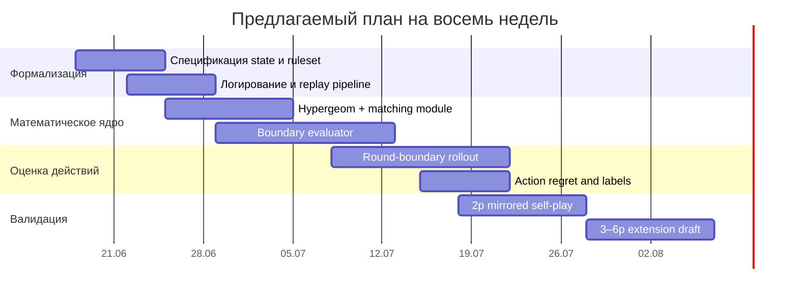

# Аналитический отчёт по выбору исследовательского трека и стартовому обзору для движка игры Дурак

## Резюме для руководителя

Хотя в мета-описании задачи сказано, что тема исследования якобы не была задана, фактически загруженный контекст задаёт очень конкретную и технически насыщенную тему: построение честной seat-view модели позиционной оценки и выбора хода для игры «Дурак», работающей при неполной информации, с явной проблемой у текущего P1-подхода, который систематически переоценивает высокие атакующие карты и проигрывает baseline P0. fileciteturn0file0

Наиболее полезный следующий исследовательский трек — не «ещё один статический оценщик» и не «ещё один one-step projected eval», а **гибридная модель round-boundary evaluation**: сравнивать действия только на общей точке горизонта, то есть после доведения ветви до конца текущего раунда и, при необходимости, до добора карт; скрытую информацию моделировать как belief state над unknown pool; вероятность покрытия одной карты считать через гипергеометрию, а покрытия набора карт — через проверку существования паросочетания в двудольном графе или через belief-sampling с matching-тестом; итоговую оценку действия строить как сочетание **локальной стоимости расхода ресурса** и **ожидаемой boundary-value**. Такой дизайн лучше согласуется с литературой по играм с неполной информацией, где устойчивые успехи достигаются либо через regret-based методы и belief-aware search, либо через скрыто-информационный lookahead с leaf evaluation, тогда как «наивный» поисковый слой без хорошей модели оппонента и без корректной leaf evaluation нередко даёт слабые результаты. citeturn10view0turn9view1turn10view1turn24view1turn24view0turn16view0turn17view0

Если цель — быстро получить **первую сильную и практически реализуемую версию**, я рекомендую выбрать трек **«позиционная функция + action score с нормализацией горизонта до конца раунда»**. Он одновременно адресует текущую патологию P1, даёт честную интерпретацию hidden information, масштабируется до 2–6 игроков через ту же belief-механику и создаёт базовый интерфейс для будущих режимов offline-ботов, self-play, label best/good/mistake/blunder и последующего обучения. fileciteturn0file0 citeturn23view0turn9view1turn10view1turn24view0

## Исходный контекст и интерпретация неопределённости

Ключевая неопределённость здесь не в теме, а в том, **какой именно исследовательский трек запускать первым**. Присланный контекст уже фиксирует домен, ограничения наблюдаемости, baseline P0, неудачу P1, heads-up как первую валидацию, но при этом не задаёт некоторые критически важные инженерные детали: жёсткий latency-budget на ход, точный целевой язык и стек production-движка, доступность размеченных логов, объём допустимого self-play, целевой объём симуляций на коммит и окончательный ruleset-профиль по transfer/throw-in/draw-order. Всё это в описании явно не уточнено. fileciteturn0file0

Из этого следует важное методологическое следствие: правильный стартовый отчёт должен не расплываться по общим советам, а **развести несколько правдоподобных исследовательских направлений внутри одной уже заданной технической темы**, выбрать наиболее универсальное и только после этого углубляться в литературу и детальный план. Такой подход особенно уместен для несовершенно наблюдаемых карточных игр, где архитектура состояния, belief-модель и точка горизонта важнее, чем выбор одного модного алгоритма. fileciteturn0file0 citeturn23view0turn10view0turn9view1

В предварительном скане применимая первичная литература оказалась преимущественно англоязычной: по играм с неполной информацией доминируют статьи по CFR/MCCFR, poker-AI, Hanabi и исследовательские платформы вроде OpenSpiel; русскоязычных первичных работ именно по движку «Дурака» практически не видно, поэтому русские источники здесь нужны скорее как правила и терминология, а не как ядро алгоритмической базы. citeturn10view0turn9view1turn10view1turn23view0turn24view0turn24view1turn24view2

## Правдоподобные темы исследования

Поскольку фактическая тема уже задана и очень конкретна, наиболее правдоподобно не придумывать посторонние домены вроде travel/health/legal, а разложить проект на **четыре реалистичных исследовательских трека**, каждый из которых мог бы быть «темой исследования» в смысле отдельного workstream.

| Трек | Scope | Ключевые вопросы | Методология | Первичные источники для старта | Оценка времени и усилий | Ожидаемые артефакты | Риски и ограничения |
|---|---|---|---|---|---|---|---|
| **Честная позиционная функция и action score для seat-view Durak** | Формализовать `E(position, seat)` и `Q(action)` без доступа к скрытым картам | Что такое сила позиции? Как оценивать ресурс карты, козырей, дублей ранга, темпа, добора, роли и эндшпиля? | Формальная модель признаков + belief state + projection к общей boundary-point | Project brief; Pagat rules; Zinkevich 2007; OpenSpiel; SciPy hypergeom; Hopcroft–Karp docs | **Средне**: 4–8 недель исследовательской работы плюс валидация | Отчёт 25–40 стр., 6–10 таблиц, 6–8 графиков, псевдокод, ablation design | Риск переусложнения `E`; риск «красивая математика, слабая игра» |
| **Поисковый слой конца раунда с belief sampling** | Построить shallow search / rollout до конца раунда или до начала следующего | Какая точка горизонта правильна? Сколько determinization/rollout нужно? | Monte Carlo по unknown pool, policy-guided response model, boundary evaluator | DeepStack; Re-determinizing IS-MCTS; VR-MCCFR; Hanabi agent-modelling | **Средне-высоко**: 5–10 недель, выше требования к симулятору | Прототип поискового слоя, сравнение latency/strength, диаграммы branching | Высокая цена инженерии и вычислений; риск variance и неверного opponent model |
| **Обобщение на multiplayer и ruleset parameterization** | Сделать архитектуру общей для 2–6 игроков и разных правил | Как переопределить pressure/value в N-player? Как кодировать transfer, throw-in, draw order? | Game-state formalization, seat-relative utilities, event-driven ruleset flags | OpenSpiel; Pagat; project brief | **Средне**: 4–7 недель после base-model | Формальная спецификация state API и ruleset matrix, тестовый набор правил | Главный риск — начать с multiplayer слишком рано и размазать сигнал |
| **Offline-аналитика, калибровка ошибок и метки best/good/mistake/blunder** | Построить экспериментальный контур до production-кода | Какие метрики истинные? Какие суррогатные? Как калибровать regret gap? | mirrored self-play, confidence intervals, stratification, pandas-based diagnostics | OpenSpiel; Wilson interval literature; VR-MCCFR; Hanabi evaluation papers | **Низко-средне**: 2–5 недель, зависит от логов | Аналитический notebook/report, action-distribution diagnostics, calibration plots | Без сильной модели легко получить «хорошую аналитику слабого агента» |

Из этих вариантов наиболее универсален первый трек. Он не конкурирует с остальными, а фактически **становится их основанием**: без корректной E/Q-функции поисковый слой будет хрупким, multiplayer-обобщение начнёт наследовать неверные приоритеты, а offline-метрики будут калибровать плохую целевую функцию. Это соответствует и практической логике платформ вроде OpenSpiel, где сначала фиксируют игру, value interface и evaluation loop, а уже потом на это наслаивают разные алгоритмы. citeturn23view0

По этой причине для основной разработки я выбираю тему: **«Честная seat-view модель позиционной оценки и выбора хода для Дурака с нормализацией горизонта до конца раунда»**. Она лучше всего отвечает текущей боли проекта — неадекватному сравнению действий на разных горизонтах и недооценке цены расхода сильной карты. fileciteturn0file0

## Выбранная тема и предварительная аналитическая модель

Главная идея выбранного трека состоит в том, что в «Дураке» нельзя честно сравнивать действие, оставляющее позицию **в середине раунда**, с действием, которое переводит игру **за границу раунда**. Именно это, по вашему описанию, и похоже на корневую причину деградации P1: действия с разным горизонтом оказываются искусственно сопоставлены как будто они находятся в одной фазе. Поэтому первой сильной версией должен стать не чистый `E(project(action))`, а **boundary-normalized action valuation**. fileciteturn0file0

Формально я рекомендую строить систему из трёх слоёв:

1. **Belief state** \(b_s(\omega)\): распределение по всем скрытым раскладам \(\omega\), совместимым с тем, что игрок честно видит из своего seat-view.
2. **Round-boundary rollout** \(R(s,a,\omega)\): доведение состояния после действия \(a\) до конца текущего раунда, а лучше — до начала следующего раунда после добора, если это предписывает ruleset.
3. **Boundary evaluator** \(V_\partial(s, seat)\): фазо-зависимая оценка позиции уже на сопоставимой точке времени.

Итоговый action-score:

\[
Q(a\mid s, seat)=\lambda_\delta \,\delta_{\text{local}}(a,s,seat)+ (1-\lambda_\delta)\,\mathbb{E}_{\omega\sim b_s}\big[V_\partial(R(s,a,\omega), seat)\big].
\]

Здесь \(\delta_{\text{local}}\) — не старый P0 целиком, а **узкий немедленный корректирующий член**, который отдельно штрафует безвозвратный расход дефицитных ресурсов: сильных козырей, редких универсальных защит, важных дублей ранга и ключевых карт для transfer/throw-in. Этот терм нужен не вместо boundary-оценки, а чтобы стабилизировать ранжирование в тех местах, где даже короткий rollout ещё не полностью «видит» цену необратимого расхода. Такая гибридность хорошо согласуется с тем, что в частично наблюдаемых играх и search, и value-function обычно работают лучше вместе, чем по отдельности. citeturn9view1turn10view1turn24view0turn24view1

Саму boundary-оценку удобно задавать на шкале \([-1000, +1000]\):

\[
V_\partial(s, seat)=1000\cdot \tanh\Big(\frac{Z(s,seat)}{\kappa}\Big),
\]

где \(Z\) — неограниченный латентный score в «карточных единицах», а \(\kappa\) — калибровочный масштаб. Тогда \(Z\) можно разложить как

\[
Z = w_h(\phi)C_h + w_t(\phi)C_t + w_q(\phi)C_q + w_p(\phi)C_p + w_d(\phi)C_d + w_i(\phi)C_i + w_o(\phi)C_o + w_e(\phi)C_e.
\]

Здесь \(\phi\) — фаза игры, например \(\phi = 1 - \frac{\text{stock\_remaining}}{\text{stock\_initial}}\). На ранней стадии \(\phi\approx 0\), в эндшпиле \(\phi \to 1\).

Смысл термов лучше задавать так. **\(C_h\)** — преимущество по числу карт: в shedding-game это один из самых «тяжёлых» факторов. **\(C_t\)** — эффективный козырный резерв, но не просто количество козырей, а сумма по их функциональной ценности. **\(C_q\)** — качество руки как баланса между disposable-картами и удерживаемыми ресурсами. **\(C_p\)** — ожидаемое давление на следующего защитника минус собственная уязвимость к следующей атаке. **\(C_d\)** — ценность дублей/мультисетов ранга и throw-in-потенциала. **\(C_i\)** — инициатива, роль и позиция в очереди. **\(C_o\)** — equity добора и порядок draw order, пока колода не пуста. **\(C_e\)** — endgame-certainty: чем ближе пустая колода, тем выше цена точного знания вышедших карт, темпа и возможности закрыть раздачу. Эта декомпозиция опирается на общую логику extensive-form imperfect-information games и хорошо переносится в frameworks вроде OpenSpiel, где отдельно живут state, belief, search и evaluation. citeturn23view0turn10view0turn9view1

Особенно важно правильно формализовать **скрытую информацию**. Для одной pending-карты \(a\), если защитник имеет \(h\) скрытых карт, unknown pool содержит \(|U|\) карт, а множество unseen-beaters для \(a\) имеет мощность \(|B(a)|\), то вероятность того, что у защитника есть хотя бы один бьющий ответ, естественно задаётся гипергеометрией:

\[
P(\text{cover } a)=1-\frac{\binom{|U|-|B(a)|}{h}}{\binom{|U|}{h}}.
\]

Это ровно тот режим «sampling without replacement», для которого и используется гипергеометрическое распределение. citeturn16view0

Для **нескольких** pending-карт независимое перемножение одиночных вероятностей уже некорректно, потому что одна карта защиты не может покрыть две атаки. Правильный объект — двудольный граф \(G(H,A,E)\), где левая доля — конкретная скрытая рука защитника \(H\), правая доля — pending-карты \(A=\{a_1,\dots,a_m\}\), а ребро \((d,a_j)\) существует тогда и только тогда, когда карта \(d\) бьёт \(a_j\). Полное покрытие возможно тогда и только тогда, когда максимальное паросочетание имеет размер \(m\). Следовательно, точная вероятность полного покрытия под равномерным belief на уровне скрытой руки выражается как

\[
P_{\text{full-cover}}(A)=
\sum_{H\subseteq U,\ |H|=h}
\frac{\mathbf{1}\{\nu(G(H,A))=m\}}{\binom{|U|}{h}},
\]

где \(\nu(G)\) — размер максимального паросочетания. На практике для matching-проверки удобно использовать Hopcroft–Karp или equivalent maximum-cardinality matching; это стандартный и хорошо документированный путь. citeturn17view0turn18search5

В реализации я бы рекомендовал трёхрежимную схему. Когда unknown pool мал и \(m\le 3\), можно позволить себе почти точный перебор. В среднем случае — Monte Carlo по скрытым рукам с matching-проверкой для каждого sample. В позднем эндшпиле, когда unknown pool уже мал сам по себе, sampling почти автоматически становится очень точным, а ценность явного учёта public history резко возрастает. Это очень хорошо сочетается с наблюдением из литературы: при ограниченном времени и в hidden-information settings критичны хорошие leaf-evaluators и корректное детерминирование скрытых состояний. citeturn10view1turn24view1turn24view2

Чтобы формально решить проблему переоценки **высоких атакующих карт**, давление и стоимость расхода нужно развести на уровне модели. Для атакующей карты \(c\) я бы писал схему вида

\[
\text{AttackUtility}(c) = G_{\text{pressure}}(c,s)-L_{\text{release}}(c,s),
\]

где

\[
G_{\text{pressure}}(c,s)=
\beta_1(1-P(\text{cover } c))
+\beta_2 \,\mathbb{E}[\text{extra throw-ins enabled}]
+\beta_3 \,\mathbb{E}[\text{role swing if take occurs}],
\]

а

\[
L_{\text{release}}(c,s)=
\alpha_1 \,\text{rank\_cost}(c,\phi)
+\alpha_2 \,\mathbf{1}_{\text{trump}}(c)\,\text{trump\_premium}(\phi)
+\alpha_3 \,\text{future\_cover\_loss}(c,s)
+\alpha_4 \,\text{scarcity\_loss}(c,s).
\]

В ранней и средней игре \(L_{\text{release}}\) должен расти **быстрее, чем линейно** по рангу для козырей и высоких универсальных защитных карт. Иначе модель почти неизбежно будет повторять болезнь P1: видеть только «эту карту труднее отбить», но не видеть, что сильная карта — это ещё и будущий резерв защиты или будущий forcing-tool. По сути, высокую атаку нельзя считать просто «сильным нажатием»; её надо считать и как удаление актива из собственного портфеля. fileciteturn0file0

Ниже — схема этого trade-off, не как откалиброванная таблица, а как **ориентир формы функции**:

```text
Illustrative early-game trade-off by rank
Rank:            6    7    8    9    10    J    Q    K    A
Pressure gain:  1.0  1.2  1.5  1.8  2.1  2.3  2.4  2.5  2.6
Release cost:   0.8  1.0  1.3  1.8  2.4  3.1  4.0  5.2  6.8
Net utility:   +0.2 +0.2 +0.2  0.0 -0.3 -0.8 -1.6 -2.7 -4.2
```

Та же логика переносится на защиту. Защита — это не бинарный факт «отбился/не отбился», а выбор между несколькими покрытиями с разной ценой. Следовательно, оценивать защиту надо через

\[
Q_{\text{defend}}(d\mid a,s)=
- L_{\text{release}}(d,s)
+ \gamma_1 \,\Delta V_{\partial}^{\text{success}}
- \gamma_2 \,\mathbb{E}[\text{follow-up vulnerability}],
\]

где \(\Delta V_{\partial}^{\text{success}}\) — ценность успешного завершения раунда и сохранения темпа, а последний терм учитывает, что «дорого отбился» может означать «сейчас не взял, но проиграл следующие две атаки». Эта поправка особенно нужна при защите козырями. fileciteturn0file0

Подкидывание естественно оценивать через **ожидаемую прибавку непокрываемого объёма**, а не только по факту, что карта совпадает по рангу со столом. Для подкинутой карты \(x\) разумна оценка вида

\[
Q_{\text{throw-in}}(x\mid s)=
\eta_1 \Delta P_{\text{take}}
+\eta_2 \Delta \mathbb{E}[\text{cards picked up}]
-\eta_3 L_{\text{release}}(x,s)
-\eta_4 \Delta \text{tempo risk}.
\]

Transfer следует оценивать тем же честным способом: не вручную завышать его роль, а считать через **смену защитника, обновление unknown pool constraint и новую boundary-value** после прокрутки transfer-ветви до общей точки горизонта. Это как раз то место, где отдельный hand-coded bonus обычно даёт иллюзию «умного хода», а честный rollout быстро показывает, когда перевод лишь перекладывает угрозу на более опасного или, наоборот, слабого защитника. fileciteturn0file0

Ниже — рекомендуемый минимальный псевдокод vNext. Комментарии оставляю на английском, чтобы их можно было почти напрямую переносить в будущий код.

```python
def evaluate_position_boundary(state, seat, cfg):
    # State must be normalized to round boundary
    phase = compute_phase(state)
    card_count_term = opponent_avg_hand_size(state, seat) - hand_size(state, seat)
    trump_term = effective_trump_reserve(state, seat, phase) - expected_opp_trump_reserve(state, seat)
    quality_term = disposable_stock(state, seat, phase) + retention_value(state, seat, phase)
    pressure_term = expected_pressure_on_next_defender(state, seat, cfg) - expected_pressure_on_me(state, seat, cfg)
    duplicate_term = rank_duplication_value(state, seat)
    initiative_term = initiative_and_role_value(state, seat)
    draw_order_term = draw_order_equity(state, seat)
    endgame_term = endgame_certainty_value(state, seat)

    z = (
        cfg.w_h(phase) * card_count_term
        + cfg.w_t(phase) * trump_term
        + cfg.w_q(phase) * quality_term
        + cfg.w_p(phase) * pressure_term
        + cfg.w_d(phase) * duplicate_term
        + cfg.w_i(phase) * initiative_term
        + cfg.w_o(phase) * draw_order_term
        + cfg.w_e(phase) * endgame_term
    )
    return 1000.0 * tanh(z / cfg.score_scale)
```

```python
def estimate_cover_probability(pending_cards, defender_hand_size, unknown_pool, cfg):
    # Exact single-card cover via hypergeometric
    if len(pending_cards) == 1:
        beaters = unseen_beaters(pending_cards[0], unknown_pool)
        U = len(unknown_pool)
        B = len(beaters)
        h = defender_hand_size
        return 1.0 - comb(U - B, h) / comb(U, h)

    # Small exact mode
    if cfg.exact_mode and len(unknown_pool) <= cfg.max_exact_unknown:
        total = 0
        covered = 0
        for H in combinations(unknown_pool, defender_hand_size):
            total += 1
            if max_matching_covers_all(H, pending_cards):
                covered += 1
        return covered / total

    # Monte Carlo mode
    success = 0
    for _ in range(cfg.n_samples):
        H = sample_hidden_hand(unknown_pool, defender_hand_size, cfg.belief_weights)
        if max_matching_covers_all(H, pending_cards):
            success += 1
    return success / cfg.n_samples
```

```python
def project_action_to_boundary(state, action, world, cfg):
    # Apply the focal action in a sampled world
    s = apply_action(state, action, world)

    # Continue with fixed response policies or shallow search
    while not is_round_boundary(s):
        player = current_actor(s)
        legal = legal_actions(s, player)
        reply = policy_or_search_choice(s, player, legal, cfg, world)
        s = apply_action(s, reply, world)

    # Optional: normalize to start of next round after refill
    if cfg.normalize_after_refill:
        s = apply_refill_and_role_rotation(s, world)
    return s
```

```python
def score_action(state, seat, action, cfg):
    local_delta = immediate_release_cost_delta(state, seat, action, cfg)
    total = 0.0
    weight_sum = 0.0

    for world, w in sample_worlds_from_belief(state, seat, cfg):
        leaf = project_action_to_boundary(state, action, world, cfg)
        total += w * evaluate_position_boundary(leaf, seat, cfg)
        weight_sum += w

    boundary_ev = total / max(weight_sum, 1e-9)
    return cfg.lambda_delta * local_delta + (1.0 - cfg.lambda_delta) * boundary_ev
```

```text
Action-scoring pipeline

Visible state
    |
    v
Belief over unknown pool
    |
    v
Sample hidden worlds consistent with seat-view
    |
    v
Apply candidate action
    |
    v
Roll out to common round boundary
    |
    v
Evaluate boundary position
    |
    v
Average across worlds + add small local release-cost term
    |
    v
Rank actions and compute regret gap
```

Для heads-up эта схема максимально естественна: один оппонент, одна скрытая рука, проще belief state, чище интерпретация hand-count advantage и draw-order equity. Для 3–6 игроков математическая структура сохраняется, но utility нужно переопределить не как «я против одного», а как **seat-centric survival/exit advantage** относительно активных соседей, прежде всего ближайшего защитника, игроков с риском быстрого выхода и порядка добора. В N-player игре полезно уже на уровне признаков ввести термы за **local neighborhood pressure**, **exit threat of next seats** и **co-attacker opportunity**, но первую строгую валидацию всё равно разумно делать на 1v1, как и предполагает исходный контекст. fileciteturn0file0 citeturn23view0

## Первичный обзор литературы

Ниже — десять источников, которые я бы поставил в стартовый reading list для выбранной темы. Явно указываю URL, как вы просили; при этом часть источников — исследования, часть — официальная документация, необходимая именно для практической реализации расчётов.

1. **John McLeod — “Durak (Fool) Card Game.”**
   Это не AI-статья, а качественный справочный источник по вариантам «Дурака», полезный для аккуратной параметризации ruleset: различие Podkidnoy/Perevodnoy, структура раунда, место transfer и throw-in. Как источник для алгоритма он вторичен, но как фиксатор формального ruleset — полезен.
   URL: `https://www.pagat.com/beating/durak.html` citeturn9view0

2. **Martin Zinkevich, Michael Johanson, Michael Bowling, Carmelo Piccione — “Regret Minimization in Games with Incomplete Information.”**
   Базовая работа по CFR, объясняющая, почему counterfactual regret — фундаментальный объект для больших extensive-form games с неполной информацией. Даже если ваш движок не будет решателем в духе CFR, статья задаёт правильный язык для reasoning о latent game value, regrets и информационных множествах.
   URL: `https://papers.nips.cc/paper_files/paper/2007/hash/08d98638c6fcd194a4b1e6992063e944-Abstract.html` citeturn10view0

3. **Matej Moravčík et al. — “DeepStack: Expert-Level Artificial Intelligence in No-Limit Poker.”**
   Для вашего проекта особенно важно не то, что это покер, а то, что работа демонстрирует сильную архитектуру для imperfect-information games: рекурсивный lookahead, decomposition и learned leaf evaluation. Это сильный аргумент в пользу гибридной схемы «короткий search + хорошая boundary/value function», а не чисто статического оценщика.
   URL: `https://arxiv.org/abs/1701.01724` citeturn9view1

4. **James Goodman — “Re-determinizing Information Set Monte Carlo Tree Search in Hanabi.”**
   Очень релевантный источник для карточной игры с скрытой информацией: он показывает, что при неаккуратной детерминизации поиск начинает «протекать» скрытой информацией и тем самым искажать opponent model. Для «Дурака» это прямое предупреждение против нечестного моделирования защитника и против pivot’а на поисковый слой без аккуратного seat-view discipline.
   URL: `https://arxiv.org/abs/1902.06075` citeturn10view1

5. **Joseph Walton-Rivers et al. — “Evaluating and Modelling Hanabi-Playing Agents.”**
   Работа ценна тем, что показывает практическую слабость голого IS-MCTS и выигрыш от предикторной модели агентов. Это хорошо поддерживает вашу интуицию, что для «Дурака» одного shallow-search недостаточно: без модели ответов защитника и без хорошего листового ценника поиск может играть слабее ручной эвристики.
   URL: `https://arxiv.org/abs/1704.07069` citeturn24view1

6. **Marc Lanctot et al. — “OpenSpiel: A Framework for Reinforcement Learning in Games.”**
   Практически необходимый ориентир по архитектуре state/action/evaluation loops. Особенно важна его широта: OpenSpiel покрывает n-player, zero-sum, general-sum, perfect и imperfect information, а также содержит CFR, MCCFR и вспомогательные инструменты оценки, то есть даёт хороший образец того, как отделять формализацию игры от формализации метода.
   URL: `https://arxiv.org/abs/1908.09453` citeturn23view0

7. **Martin Schmid et al. — “Variance Reduction in Monte Carlo Counterfactual Regret Minimization.”**
   Если вы позже захотите использовать sampled extensive-form methods для обучения или валидации, эта статья важна из-за центральной проблемы variance. Для текущего проекта её практический урок звучит так: Monte Carlo по hidden states полезен, но без аккуратной variance control и baseline design вы получите шумный и дорогостоящий signal.
   URL: `https://arxiv.org/abs/1809.03057` citeturn24view0

8. **Fandi Meng, Simon Lucas — “Deduction Game Framework and Information Set Entropy Search.”**
   Эта более свежая работа не про «Дурака», но про объяснимый information-set search и ограниченные вычислительные бюджеты. Она интересна тем, что подталкивает не только к win-probability, но и к интерпретируемым показателям информационной ценности состояния, что может быть полезно для будущего explainable-analysis режима вашего движка.
   URL: `https://arxiv.org/abs/2407.21178` citeturn24view2

9. **SciPy documentation — `scipy.stats.hypergeom`.**
   Это официальный практический источник для гипергеометрии: ровно того распределения, которое нужно для честной вероятности покрытия одной карты из unknown pool без возвращения. Для research-to-implementation перехода такой источник ценнее красивой теории без работающего интерфейса, потому что связывает формулу, параметры и API.
   URL: `https://docs.scipy.org/doc/scipy/reference/generated/scipy.stats.hypergeom.html` citeturn16view0

10. **NetworkX documentation — `hopcroft_karp_matching`.**
    Для многокарточного покрытия ключевой технический шаг — проверка максимального паросочетания в двудольном графе «карты защиты ↔ pending атаки». Официальная документация NetworkX удобна тем, что сразу связывает теорию matching с практической функцией и указывает на классическую статью Hopcroft–Karp.
    URL: `https://networkx.org/documentation/stable/reference/algorithms/generated/networkx.algorithms.bipartite.matching.hopcroft_karp_matching.html` citeturn17view0

По этому набору видно важное: центр тяжести литературы находится не в «специальных статьях про Дурака», а в **общих методах для hidden-information games** и в формальных кирпичиках, из которых потом собирается честный seat-view движок. Для вашего проекта это, скорее, плюс: можно избежать premature overfitting к частному hand-crafted baseline и сразу проектировать модель в общепринятой теоретической рамке. citeturn10view0turn9view1turn10view1turn23view0turn24view0turn16view0turn17view0

## Детальный план исследования

Рекомендованный план я бы строил как короткий, но строгий цикл из спецификации, математики, rollout-движка и валидации. Самый важный принцип — не смешивать всё сразу. Сначала формализуется **ruleset-aware state model**, затем — **belief and cover estimation**, затем — **boundary evaluator**, после чего добавляется **action scoring to common horizon** и только потом запускается полноценная экспериментальная сетка. Такой порядок снижает риск повторить судьбу P1, когда привлекательная идея looked one-step ahead, но сравнивала неоднородные состояния. fileciteturn0file0

Практически я бы поставил следующие вехи:

| Веха | Содержимое | Данные и методы | Нужная экспертиза | Оценка бюджета |
|---|---|---|---|---|
| **Спецификация состояния** | Формальное описание visible state, unknown pool, event log, ruleset flags, round boundary | Существующие игровые логи, replay generator, unit tests на правила | Игровая логика, formal modeling | **Низкий**: €1,000–€2,500 |
| **Модуль вероятностей покрытия** | Hypergeometric single-cover, matching-based full-cover, Monte Carlo fallback | Python prototype, exhaustive checks on small states | Probability, combinatorics, graph algorithms | **Низкий**: €1,500–€3,500 |
| **Boundary evaluator** | Конструирование и калибровка `V_\partial` | Offline notebooks, ablation study, feature importance by phase | Game AI, statistical analysis | **Средний**: €2,500–€6,000 |
| **Action scorer** | `Q(a)=local_delta + boundary_EV` с belief sampling | Simulated games, mirrored seeds, latency profiling | Search/planning, systems engineering | **Средний**: €3,000–€8,000 |
| **Валидация heads-up** | P0 vs P1 vs vNext, action-distribution diagnostics, CI | Self-play + simple/heuristic bot baselines | Experimental design, pandas, statistics | **Средний**: €2,000–€5,000 |
| **N-player extension** | Utility reshaping, pressure neighborhoods, turn-order terms | 3–6p tournaments, ruleset matrix tests | Multiplayer game theory, simulation infra | **Средне-высокий**: €4,000–€12,000 |

Суммарно это даёт три разумных бюджета. **Low**: €3,000–€7,000 — если нужен исследовательский прототип с Python-аналитикой, ограниченный 1v1 и без жёсткой оптимизации. **Medium**: €8,000–€20,000 — если нужна уже добротная первая версия vNext, несколько сотен тысяч или миллионы self-play hands, action-diagnostics и частичная интеграция в движок. **High**: €25,000–€60,000 — если вы хотите одновременно 2p и 3–6p, строгий ablation suite, оптимизированный симулятор, ruleset matrix и подготовку инфраструктуры для последующего обучения/разбора партий. Эти диапазоны — оценка на основе типового объёма R&D-работ такого класса; в исходном описании точный ресурсный контур не задан. fileciteturn0file0

Ниже — рекомендованный восьминедельный план в форме Gantt-диаграммы.



С точки зрения сбора данных я бы использовал три канала. Первый — **exhaustive microstates**: все малые позиции с маленьким unknown pool, где можно близко подойти к точному значению и валидировать отдельные модули. Второй — **mirrored self-play seeds** для парных сравнений P0/P1/vNext на одинаковых случайных раскладах. Третий — **structured scenario suites**: искусственно собранные позиции, где проверяются именно патологические случаи, например «атака старшей картой vs низкой картой при одинаковом текущем pressure signal». Такой дизайн намного информативнее голого общего winrate. fileciteturn0file0

Именно здесь стоит ввести и метки качества хода. Я бы не задавал fixed thresholds «best/good/mistake/blunder» руками, а калибровал их на распределении **regret gap**:

\[
\text{regret}(a)=Q(a^\*,s)-Q(a,s).
\]

Тогда метки становятся не психологическими, а статистическими: например, через условные квантили по фазе игры, роли и классу горизонта. Это особенно важно, потому что цена ошибки в эндшпиле и в начале игры может различаться на порядок. В описании проекта такой классификационный интерфейс прямо заявлен как целевая функциональность, но конечные thresholds пока не специфицированы. fileciteturn0file0

## Риски, ограничения и рекомендуемые визуализации

Главное ограничение выбранного подхода состоит в том, что он всё равно остаётся **эвристическим**, а не полным game-solving. CFR-подобные методы дают мощную теоретическую рамку для extensive-form games с неполной информацией, но в прикладном инженерном движке «Дурака» вам почти наверняка придётся жить в мире аппроксимаций: belief sampling вместо полного belief enumeration, modelled responses вместо оптимального ответа, feature-based boundary evaluator вместо истинного value function. Это нормально, но только если ошибки аппроксимации **видимы и измеримы**. citeturn10view0turn24view0turn23view0

Второй крупный риск — **variance и data leakage**. Как только в ход идёт Monte Carlo по unknown pool, сильно возрастает цена неточной калибровки и опасность нечестной подглядки. Работы по Hanabi и re-determinizing IS-MCTS прямо предупреждают, что hidden-information search легко начинает использовать не ту информацию, которая реально доступна агенту, и тогда apparent strength скрывает архитектурную нечестность. Для вашего проекта это особенно критично, поскольку исходная постановка жёстко требует честного seat-view режима. citeturn10view1turn24view1

Третий риск — **неправильная целевая метрика**. Winrate нужен, но он не должен быть единственным судьёй: в исходной постановке справедливо сказано, что нужен именно позиционный score, а win probability — лишь валидационная побочная метрика. Следовательно, истинные метрики здесь — это, прежде всего, heads-up winrate on mirrored seeds, regret gap against best model action, action-distribution sanity, phase-stratified error patterns и устойчивость к ruleset variations. А вот такие показатели, как raw leaf score, average heuristic delta или «модель стала чаще выбирать transfer», — это только внутренние суррогаты. fileciteturn0file0

Для визуализации я рекомендую следующий обязательный минимум. Во-первых, **гистограмму выбранных рангов атакующих карт** для P0, P1 и vNext: именно она, судя по описанию, уже проявила патологию P1. Во-вторых, **heatmap regret by action kind × phase**. В-третьих, **кривые cover probability** по рангу, масти и размеру unknown pool. В-четвёртых, **calibration plot**: предсказанный action regret против фактического падения boundary value на rollout-сценариях. В-пятых, **эндшпильную панель**: score sensitivity к каждому оставшемуся unseen trump. Эти визуализации намного быстрее показывают, что именно «сломалось», чем голый итоговый winrate. fileciteturn0file0 citeturn16view0turn17view0turn24view0

В качестве маленького образца полезной проектной диаграммы можно уже сейчас использовать такую ASCII-сводку для контроля патологии P1:

```text
Observed attack-rank tendency (illustrative from project brief)
P0 top-attack average rank    :  ~8.0   ████
P1 top-attack average rank    : ~12.6   █████████
vNext target corridor         : 8.5–9.5 █████
```

И наконец, если сформулировать стартовые гипотезы, которые действительно стоит проверить первыми, они будут такими. Первая: **сравнение действий на общей round boundary устранит большую часть P1-патологии без сложного обучения**. Вторая: **добавление явной release-cost функции для сильных карт уменьшит завышение высоких атак даже до полного search-layer**. Третья: **matching-based multi-cover estimate даст заметный прирост против независимых одиночных вероятностей**. Четвёртая: **в эндшпиле значение точного card counting растёт быстрее, чем значение грубых hand-quality эвристик**. Пятая: **в 1v1 честный hybrid boundary model даст лучший прирост на единицу инженерной сложности, чем ранний переход к full multiplayer search**. Все пять гипотез прямо вытекают из присланного проблемного описания и из того, как современная литература по hidden-information games объясняет силу search/value hybrids и слабости наивного search без хорошей leaf evaluation. fileciteturn0file0 citeturn9view1turn10view1turn24view1turn24view0turn24view2